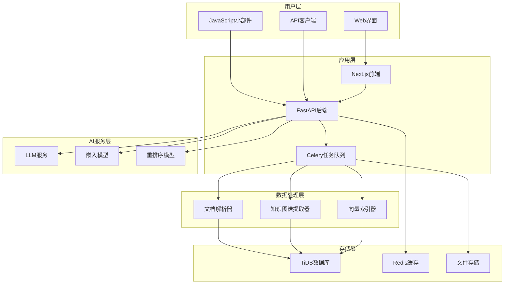
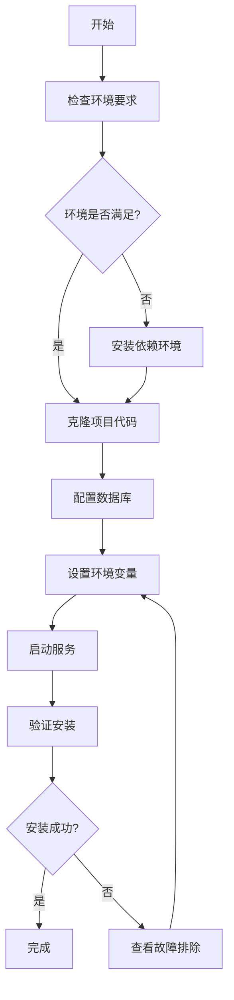

# AutoFlow 技术文档

## 📋 目录

- [项目概述](#项目概述)
- [主要功能](#主要功能)
- [技术栈](#技术栈)
- [系统架构](#系统架构)
- [快速开始](#快速开始)
- [核心概念](#核心概念)
- [部署指南](#部署指南)

## 🚀 项目概述

AutoFlow 是一个基于知识图谱的开源RAG（检索增强生成）框架，专为构建智能问答系统和知识库而设计。它结合了向量搜索和知识图谱技术，提供更准确、更具上下文感知的AI问答体验。

### 核心价值

- **🧠 智能检索**：结合向量搜索和知识图谱，提供更精准的信息检索
- **🔗 知识关联**：自动构建实体间的关系网络，增强答案的逻辑性
- **⚡ 高性能**：基于TiDB向量数据库，支持大规模数据处理
- **🛠 易于集成**：提供Python SDK和REST API，支持多种部署方式
- **🌐 企业级**：支持分布式部署，具备高可用性和可扩展性

## ✨ 主要功能

### 1. 知识图谱RAG
- 自动从文档中提取实体和关系
- 构建知识图谱索引
- 基于图结构的智能检索

### 2. 向量搜索
- 支持多种嵌入模型
- 语义相似度搜索
- 混合检索策略

### 3. 对话式搜索
- Perplexity风格的对话界面
- 流式响应
- 上下文感知的多轮对话

### 4. 文档管理
- 支持多种文档格式（PDF、Markdown、HTML等）
- 自动文档解析和分块
- 批量文档导入

### 5. 可嵌入组件
- JavaScript小部件
- 一键集成到网站
- 自定义样式和配置

## 🛠 技术栈

### 后端技术
- **数据库**: [TiDB](https://www.pingcap.com/ai) - 分布式SQL数据库，支持向量搜索
- **RAG框架**: [LlamaIndex](https://www.llamaindex.ai/) - 企业级RAG框架
- **AI编程**: [DSPy](https://github.com/stanfordnlp/dspy) - 基于编程的AI模型框架
- **Web框架**: FastAPI - 高性能Python Web框架
- **任务队列**: Celery + Redis - 异步任务处理

### 前端技术
- **框架**: [Next.js](https://nextjs.org/) - React全栈框架
- **样式**: [Tailwind CSS](https://tailwindcss.com/) - 实用优先的CSS框架
- **组件**: [shadcn/ui](https://ui.shadcn.com/) - 现代化UI组件库

### AI模型支持
- **LLM**: OpenAI GPT系列、Claude、本地模型等
- **嵌入模型**: OpenAI Embeddings、本地嵌入模型
- **重排序**: 支持多种重排序模型

## 🏗 系统架构

### 整体架构图



### 核心组件

#### 1. 知识库管理
- **文档存储**: 支持多种格式的文档存储和管理
- **分块处理**: 智能文档分块，保持语义完整性
- **索引构建**: 同时构建向量索引和知识图谱索引

#### 2. 检索引擎
- **混合检索**: 结合向量搜索和知识图谱检索
- **查询优化**: 基于知识图谱优化用户查询
- **结果融合**: 智能融合多种检索结果

#### 3. 生成引擎
- **上下文构建**: 基于检索结果构建丰富的上下文
- **流式生成**: 支持实时流式响应
- **多轮对话**: 维护对话历史和上下文

## 🚀 快速开始

### 环境要求

- **Python**: 3.10+
- **Node.js**: 18+
- **数据库**: TiDB 或 MySQL 5.7+
- **内存**: 最少8GB RAM
- **CPU**: 4核心以上推荐

### 安装流程图



### 1. 使用Docker Compose（推荐）

这是最简单的部署方式，适合快速体验和开发环境。

```bash
# 1. 克隆项目
git clone https://github.com/pingcap/autoflow.git
cd autoflow

# 2. 创建环境配置文件
cp .env.example .env

# 3. 编辑配置文件
nano .env
```

**必需的环境变量配置：**

```bash
# 数据库配置
TIDB_HOST=your-tidb-host
TIDB_PORT=4000
TIDB_USERNAME=your-username
TIDB_PASSWORD=your-password
TIDB_DATABASE=autoflow

# OpenAI配置
OPENAI_API_KEY=your-openai-api-key

# 应用配置
SECRET_KEY=your-secret-key
NEXTAUTH_SECRET=your-nextauth-secret
```

```bash
# 4. 启动服务
docker-compose up -d

# 5. 验证服务状态
docker-compose ps
```

### 2. Python SDK安装

对于开发者，可以直接使用Python SDK：

```bash
# 安装AutoFlow
pip install autoflow-ai

# 或从源码安装
git clone https://github.com/pingcap/autoflow.git
cd autoflow/core
pip install -e .
```

### 3. Hello World示例

创建你的第一个知识库：

```python
import os
from autoflow import Autoflow
from autoflow.configs.db import DatabaseConfig
from autoflow.configs.main import Config
from autoflow.models.llms import LLM
from autoflow.models.embedding_models import EmbeddingModel

# 初始化AutoFlow
af = Autoflow.from_config(
    config=Config(
        db=DatabaseConfig(
            host=os.getenv("TIDB_HOST"),
            port=int(os.getenv("TIDB_PORT")),
            username=os.getenv("TIDB_USERNAME"),
            password=os.getenv("TIDB_PASSWORD"),
            database=os.getenv("TIDB_DATABASE"),
        )
    )
)

# 创建知识库
kb = af.create_knowledge_base(
    name="我的第一个知识库",
    description="这是一个测试知识库",
    llm=LLM("gpt-4o-mini"),
    embedding_model=EmbeddingModel("text-embedding-3-small"),
)

# 添加文档
documents = kb.add("./my-document.pdf")
print(f"成功添加 {len(documents)} 个文档")

# 搜索文档
result = kb.search_documents("什么是人工智能？", top_k=3)
for chunk in result.chunks:
    print(f"相关度: {chunk.score:.3f}")
    print(f"内容: {chunk.text[:100]}...")

# 智能问答
response = kb.ask("请解释人工智能的基本概念")
print(f"回答: {response.message.content}")
```

## 🧠 核心概念

### 知识库 (Knowledge Base)
知识库是AutoFlow的核心概念，它包含：
- **文档集合**: 原始文档和元数据
- **向量索引**: 用于语义搜索的向量表示
- **知识图谱**: 实体和关系的结构化表示
- **配置信息**: 模型配置和处理参数

### 检索方法 (Index Methods)
AutoFlow支持多种检索方法：
- `VECTOR_SEARCH`: 基于向量的语义搜索
- `KNOWLEDGE_GRAPH`: 基于知识图谱的关系检索

### 文档处理流程
1. **文档解析**: 提取文本内容和结构信息
2. **智能分块**: 保持语义完整性的文档分割
3. **向量化**: 生成文本的向量表示
4. **知识提取**: 识别实体和关系
5. **索引构建**: 建立搜索索引

## 🐳 部署指南

### 生产环境部署

#### 1. 系统要求
- **CPU**: 8核心以上
- **内存**: 16GB以上
- **存储**: SSD，100GB以上
- **网络**: 稳定的互联网连接

#### 2. 数据库准备
推荐使用TiDB Cloud或自建TiDB集群：

```sql
-- 创建数据库
CREATE DATABASE autoflow;

-- 创建用户（可选）
CREATE USER 'autoflow'@'%' IDENTIFIED BY 'your-password';
GRANT ALL PRIVILEGES ON autoflow.* TO 'autoflow'@'%';
FLUSH PRIVILEGES;
```

#### 3. 环境配置
生产环境的完整配置示例：

```bash
# .env 生产环境配置
NODE_ENV=production

# 数据库配置
TIDB_HOST=your-tidb-host
TIDB_PORT=4000
TIDB_USERNAME=autoflow
TIDB_PASSWORD=your-secure-password
TIDB_DATABASE=autoflow
TIDB_SSL_ENABLED=true

# AI模型配置
OPENAI_API_KEY=your-openai-api-key
OPENAI_BASE_URL=https://api.openai.com/v1

# 应用安全配置
SECRET_KEY=your-very-secure-secret-key
NEXTAUTH_SECRET=your-nextauth-secret
NEXTAUTH_URL=https://your-domain.com

# Redis配置
REDIS_URL=redis://your-redis-host:6379

# 文件存储配置
STORAGE_TYPE=s3
AWS_ACCESS_KEY_ID=your-access-key
AWS_SECRET_ACCESS_KEY=your-secret-key
AWS_S3_BUCKET=your-bucket-name
AWS_REGION=us-east-1

# 监控配置
LANGFUSE_PUBLIC_KEY=your-langfuse-public-key
LANGFUSE_SECRET_KEY=your-langfuse-secret-key
LANGFUSE_HOST=https://your-langfuse-host
```
